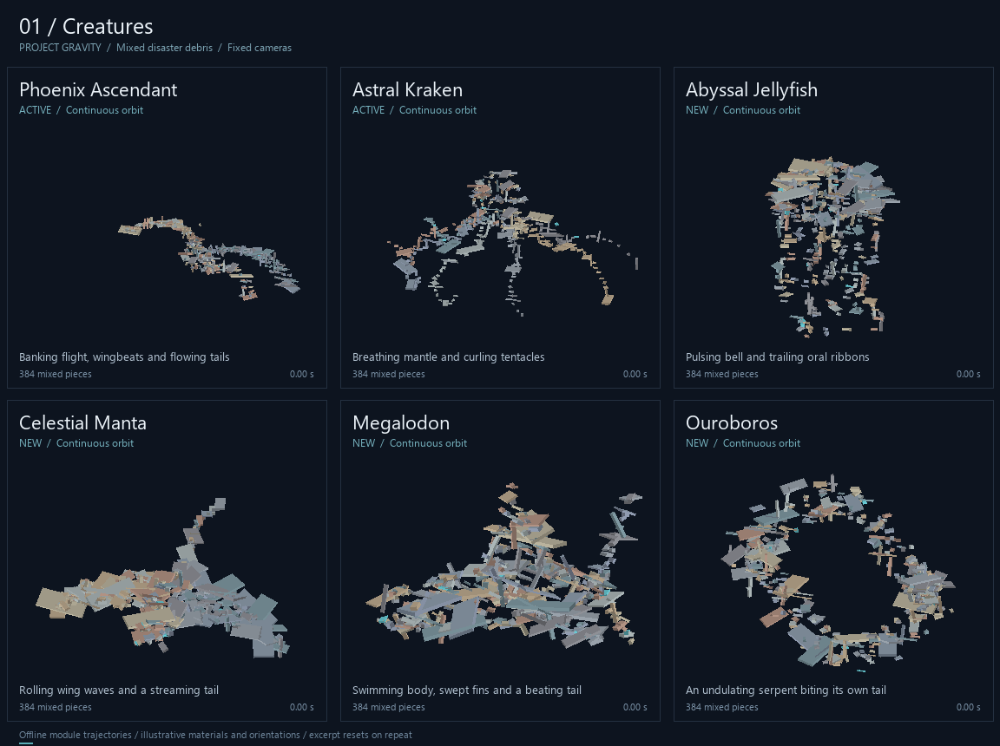

# Project Gravity.

Project Gravity is a Roblox script that grabs unanchored parts and moves them around you in different shapes using physics constraints

## Features
- Grabs unanchored parts automatically
- Has 75 active shapes, including Black Hole v2 and 15 formations designed around uneven disaster debris
- Works on both Desktop and Mobile
- Let's you tweak speed, damping, and other physics live
- Formation controls in the Advanced panel: slow down or reverse the shape's clock, mix two
  shapes together, preview a formation with markers before grabbing anything, sort which part
  gets which slot, cap how many parts are held, and filter what may be claimed by size, name,
  tag or distance
- Saves your settings automatically
- Shape plugins support real action buttons and circular mobile steering
- The UI's **X** fully unloads the session, including the core, constraints and keybinds

### Shape and plugin update

**Black Hole v2** spirals parts inward into a core that spins rapidly on all three axes.
**Pull In Speed** controls how quickly they reach the center; **Spiral Speed**
controls their orbit. **Core Spin X/Y/Z (deg/s)** independently tune the core up to
7,200 degrees per second per axis. Ring and jet percentages start at zero so every
part joins the center by default; raise them for an accretion ring or polar jets.
Use its **Regrab All Parts**, **Stop Grabbing** and **Explode** buttons to recapture,
release or launch debris. Released parts follow normal gravity and keep their momentum.

**Phoenix Ascendant** now bends through turns from head to tail, with wingbeats
traveling through the feathers. **Megalodon** follows a banked 3D patrol with swoops
and a trailing body. Archived **Drop** smoothly gathers a canopy before releasing
a staggered wave, with controls for timing, scatter and momentum.

On touch devices, **Broom**, **Twin Core Beam**, **Goro** and **Raigo** have a circular
steering stick and a separate action button. One finger aims while another acts.

The **[plugin guide](docs/PLUGINS.md)** covers the module API, Buttons, mobile input,
release physics and cleanup. The **[documentation website](https://projectgravity.pages.dev/)**
includes **Copy full LLM prompt**; the [plain text prompt](docs/plugins/plugin-prompt.txt)
can also be pasted into Project UAI or another AI.

**[Updated creature paths](docs/plugins/creatures-motion.gif)** ·
**[Black Hole v2 and Drop preview](docs/plugins/release-motion.gif)**

### New formations

**[Watch every shape move: 13 GIFs, six shapes per GIF](docs/motion/index.md).**
This gallery is a snapshot of the earlier 74 active shapes plus four review modules,
with scripted inputs labeled for interactive tools. It predates Black Hole v2 and the
latest Phoenix, Megalodon and Drop changes.



The 15 additions are **Abyssal Jellyfish, Void Cathedral, Ouroboros, Hopf Fibration,
Celestial Manta, Megalodon, World Tree, Ragnarok Hammer, Eclipse Scythe, Aegis Bastion,
Singularity Trident, Ghost Galleon, Infernal Skull, Chrono Hourglass, and Storm Gyre**.
Find them by name in the desktop or mobile shape selector.

They use compact silhouettes, deterministic part placement, and broad structural
features for Natural Disaster Survival's mixed bricks, beams and wall panels.
**Debris Scale %** starts at 55; reduce it when there is less rubble to fill the shape.
The formation keeps a small shared orbit even when its pattern speed or Formation
Time Scale is zero. The six earlier showcase formations and the improved Torus Knot,
Klein Bottle and Möbius Strip also use this continuous motion.

**[Formation guide, images and math improvements](docs/FORMATIONS.md)** includes the
dense and sparse debris galleries, controls, and the details of Phoenix banking,
complete stacked Rift mouths, even-speed torus links, and continuous surface seams.
The previews show actual module trajectories in a synthetic debris fixture; live
Roblox physics and network ownership still depend on the game session.

## Usage
Just run `main.lua` in your executor. It pulls the rest of the files directly from GitHub

The **PROJECT UAI** button launches [Project UAI](https://github.com/CarlDV/ProjectUAI) on demand.

### Controls
- **E**: Start script (grabs parts)
- **Q**: Stop/reset (drops parts and removes the core; press E to restart)
- **UI X**: Fully unload (removes the UI, core, constraints and keybinds)
- **P**: Pause parts
- **L**: Disable constraints entirely
- **Left Click**: Hold the anchor to move the center around with your mouse

## Directory
- `main.lua`: The loader
- `System.lua`: Runs the physics math and loops
- `config.lua`: Default settings and shape variables
- `UI.lua` / `UI_elements.lua`: The UI stuff
- `shapes/`: The math for how each shape is positioned
- `shapes-onreview/`: Four experimental modules, labeled separately in the motion gallery
- `docs/`: Formation guide, plugin website, copyable LLM prompt and motion galleries
- `tools/`: Reproducible previews and the standalone Luau test runner
- `/mobilever`: The UI and stuff for mobile users ,ex UI

## Shape validation

Use Python and the standalone [Luau CLI](https://github.com/luau-lang/luau/releases)
to run the suites, including modules using `continue` and Unicode filenames:

```powershell
python tools/test_luau.py --luau PATH_TO_LUAU tests/plugin_actions.lua
python tools/test_luau.py --luau PATH_TO_LUAU tests/mobile_controls.lua
python tools/test_luau.py --luau PATH_TO_LUAU tests/session_lifecycle.lua
python tools/test_luau.py --luau PATH_TO_LUAU tests/insane_shapes_smoke.lua
python tools/test_luau.py --luau PATH_TO_LUAU tests/math_curves_smoke.lua
python tools/test_luau.py --luau PATH_TO_LUAU tests/formation_smoke.lua
node tests/plugin_docs.test.js
python tools/sync_plugin_docs.py --check
```

These cover geometry, control limits, mixed part sizes, timing, continuously moving
frozen poses, late claims, cleanup, topology and desktop/mobile runtime behavior.

The [gallery index](docs/motion/index.md) records the historical demonstration
settings and explains the scripted inputs.

Rebuild the updated clips with the standalone Luau CLI and Pillow:

```powershell
python tools/preview_updates.py --luau PATH_TO_LUAU
```

---
JUN 25 : 12:12AM GMT+8 (PHT)
