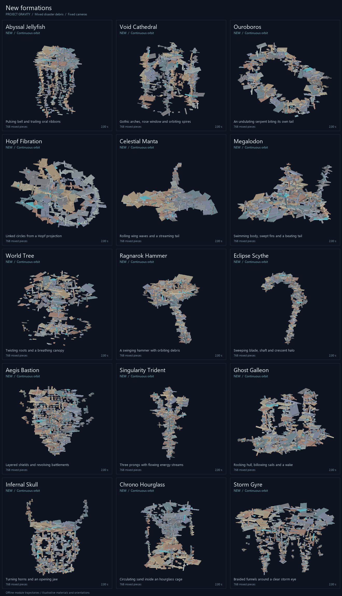
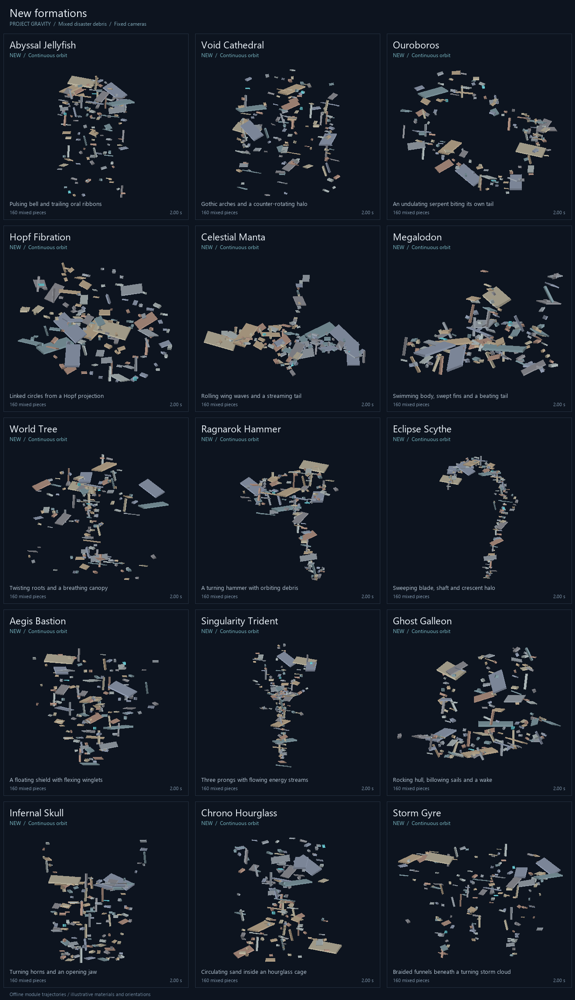

# Formations for mixed disaster debris

Fifteen new formations join the desktop and mobile catalogs. Their geometry is
designed around the uneven unanchored bricks, planks, beams and wall panels found
in **Natural Disaster Survival**. Compact defaults, broad silhouettes and stable
part assignments help the figures hold together when the available debris changes.

**[Earlier 78-shape motion gallery](motion/index.md)** — 13 GIFs with six shapes
each, including four review modules. This snapshot predates Black Hole v2 and the latest
Phoenix, Megalodon and Drop updates; there are now 75 active shapes.

## The fifteen additions

| Shape | Motion and structure | Useful controls |
| --- | --- | --- |
| Abyssal Jellyfish | A contracting bell, scalloped rim, curling tentacles and folded oral ribbons. | Bell Pulse %, Tentacle Length, Tentacle Curls |
| Void Cathedral | Pointed arches and buttresses around an open nave, spires and a counter-rotating halo. | Spire Towers, Vault Rise %, Rose Window Petals |
| Ouroboros | A serpent closes into a ring, with a modeled head, fins and a traveling body wave. | Serpent Radius, Body Thickness, Body Undulation |
| Hopf Fibration | Linked circular fibres derived from a Hopf projection move through a 4D rotation. | Linked Circles, Filament Radius, Bundle Spread % |
| Celestial Manta | Broad swept wings roll in a swimming wave, with a body, head lobes and streaming tail. | Wing Reach, Wing Ripple %, Ribbon Tail Length |
| Megalodon | A tapered shark follows a banked 3D patrol, with a bending body, swept fins and a beating forked tail. | Patrol Swoop Height, Turn Banking, Body Follow Through % |
| World Tree | A twisting trunk connects roots, branches and a breathing canopy. | Tree Height, Canopy Reach, Boughs per Tier |
| Ragnarok Hammer | A solid-faced hammer, wrapped grip and pommel turn beneath an orbiting debris halo. | Hammer Half Width, Handle Length, Hammer Tilt |
| Eclipse Scythe | A thick crescent blade, curved shaft and orbiting fragments sweep through space. | Crescent Radius, Haft Length, Crescent Sweep % |
| Aegis Bastion | A convex shield with a raised boss and flexing winglets slowly turns and levitates. | Shield Convexity, Winglet Reach, Levitation Sway |
| Singularity Trident | Three substantial prongs grow from a wrapped shaft, with a turning halo around the head. | Fork Spread, Handle Length, Prong Length |
| Ghost Galleon | A rocking hull carries masts and billowing sails, with a trailing wake. | Hull Half Length, Mast Height, Sail Fullness % |
| Infernal Skull | A turning horned cranium has open eye sockets and a separate animated jaw. | Horn Length, Horn Sweep %, Jaw Opening % |
| Chrono Hourglass | Two glass-shaped lobes surround a continuous circulating sand stream; the frame rocks gently. | Bowl Radius, Hourglass Height, Sand Flow Speed |
| Storm Gyre | Multiple braided funnels hang beneath a broad storm cloud and smoothly shaped lightning strands. | Twister Count, Twister Separation, Lightning Reach |

Every new shape also has **Debris Scale %**, starting at **55**. Scale changes the
silhouette around its hover-height pivot, so making a figure more compact does not
move its anchor height. The range is 25–150. Most new shapes route oversized panels
into a substantial body feature instead of fine appendages. Part identities use
deterministic sampling, so late claims join the current animation phase.

## Debris galleries

These images execute the actual shape modules with synthetic irregular cuboids.
The size mix includes small bricks, long beams, and wall panels up to 40 × 2 × 16
studs. Colors and orientations are illustrative; the files are not game captures.

**768 pieces per formation, default shape settings:**



**160 pieces per formation, default shape settings:**



With a small part budget, reduce Debris Scale % toward 35–45 and reduce repeated
features such as tentacles, fibres or branches. With more debris, raise the scale
and feature counts together. Thin appendages naturally lose detail before broad
body features. Formation Preview can help choose a size before claiming debris.

## Movement when the pattern is frozen

The fifteen additions, the six earlier showcase formations, Torus Knot, Klein
Bottle and Möbius Strip receive a shared motion offset from the runtime. It follows
a six-stud horizontal orbit with a 1.5-stud vertical sway, on an independent real
clock. Every part receives exactly the same offset after debris scaling.

Setting pattern speed or Formation Time Scale to zero holds the internal pose
while this orbit continues. Reversing the formation clock reverses the pattern;
the real-time orbit continues forward. The movement preserves the silhouette and
avoids holding every piece at a static target. Full Pause retains the existing
anti-sleep velocity behavior. Actual network ownership is controlled by Roblox;
these offline checks do not establish retention in a live NDS server.

## Other shape math improvements

- **Phoenix Ascendant:** an analytic path tangent leads a chain of delayed flight
  frames. The head leads into turns, the torso bends, and the tail follows older
  headings. **Body Follow Through %** controls the bend; **Wing Flex %** adds
  feather motion that travels across the wings. Smooth pitch limiting handles
  near-vertical flight, and **Turn Banking** makes it lean into curved paths.
- **Megalodon:** a smooth 3D patrol replaces the flat orbit. **Patrol Swoop Height**
  adds vertical travel, **Turn Banking** leans into curves, and **Body Follow
  Through %** carries the turn down the spine to the tail. Path frames are cached
  once per formation frame; late claims join the same pose.
- **Black Hole v2:** a tightening spiral draws every part into a filled sphere.
  Parts keep their direction of rotation as they enter, then hold a constant
  radius and height. **Pull In Speed** sets the inward rate; **Spiral Speed** sets
  the swirl. **Ball Spin Speed (deg/s)** defaults to 720 about one stable upright
  axis. Radius changes ease smoothly, and an accretion ring is optional.
  Real buttons regrab, release or explode the tracked parts; gravity acts with
  the actuators disabled after an explosion.
- **Drop (review/archive):** gathers a distributed canopy smoothly, holds it, then
  releases a configurable staggered wave. **Drop Now** starts the wave early;
  downward speed, scatter and incoming momentum control the release.
- **Rift Gate:** gate-local indexing now populates both mouths, blades and
  connecting strands for every gate in an even-sized stack.
- **Torus Knot:** arc-length sampling evens out travel speed. Non-coprime winding
  numbers produce all components of the corresponding torus link. Winding
  controls are integral, and the shared clock avoids late-claim phase offsets.
- **Klein Bottle:** a figure-eight immersion replaces the malformed surface;
  radius scales every term consistently, and the double cover crosses the seam
  continuously.
- **Möbius Strip:** a continuous two-turn traversal handles the half-twist seam
  while preserving deterministic slot placement and shared animation timing.
- **Celestial Ribbon:** elapsed time is no longer forced positive, so frozen
  and reversed formation clocks behave as requested.

## Reproduce the images and checks

The updated [creature clip](plugins/creatures-motion.gif) and
[Black Hole v2 / Drop clip](plugins/release-motion.gif) use Python, Pillow and the
standalone [Luau CLI](https://github.com/luau-lang/luau/releases):

```powershell
python tools/preview_updates.py --luau PATH_TO_LUAU
```

The commands below describe the older gallery exporter. The test suites use the
standalone Luau runner shown after them.

Install [Lune 0.10+](https://github.com/lune-org/lune), Python and Pillow. The sampler
uses native Roblox vector/CFrame value types in Lune, a fixed random seed, explicit
service fixtures and persistent per-part state. Ordinary geometry previews follow
module target positions. Slingshot, Sculptor, Gods Call and the impact tools use a
simple velocity integrator. Drop uses a separate gravity/floor fixture. Collisions,
mass, constraint lag and ownership are not simulated.

From the repository root:

```powershell
python tools/preview_shapes.py --parts 768 --time 2 --cell 440 --output docs/shape-gallery.png
python tools/preview_shapes.py --parts 160 --time 2 --cell 440 --output docs/shape-gallery-sparse.png
python tools/preview_shapes.py --all --parts 384 --cell 384 --frames 72 --duration 6 --output docs/motion
```

For a custom six-shape GIF, repeat `--shape` six times and supply `--frames` and a
`.gif` output. `--mode markers` shows target geometry; `--set k24=40` overrides a
shape control. Pass `--lune PATH` if needed. Sample caches live in the OS temporary
directory and are invalidated when the module, config, sampler or runtime changes.

```powershell
python tools/test_luau.py --luau PATH_TO_LUAU tests/insane_shapes_smoke.lua
python tools/test_luau.py --luau PATH_TO_LUAU tests/math_curves_smoke.lua
python tools/test_luau.py --luau PATH_TO_LUAU tests/formation_smoke.lua
python tools/test_luau.py --luau PATH_TO_LUAU tests/formation_lint.lua
python tools/test_luau.py --luau PATH_TO_LUAU tests/controls_lint.lua
python tools/test_luau.py --luau PATH_TO_LUAU tests/slider_range_lint.lua
python tools/test_luau.py --luau PATH_TO_LUAU tests/load_build_smoke.lua
```

The suites check finite geometry across slider extremes, mixed sizes, deterministic
slots, frame continuity, frozen poses with continuous motion, cleanup, Phoenix
vertical flight, complete Rift stacks, constant-speed curves, double-cover seams,
scale invariance and pairwise Hopf linking. Desktop and mobile runtime wiring is
checked separately. The GIF exporter also verifies full catalog coverage, six
shapes per group, finite trajectories, moving geometry, frame counts and playback
duration. [manifest.json](motion/manifest.json) records the gallery settings.
