# Shape motion gallery

All **78 shapes**, in **13 GIFs with six shapes each**: 74 active and four review modules.

Each clip shows 6 seconds at 12 fps, using 384 uneven pieces per shape. Bricks, planks, beams and wall panels keep the same identities and illustrative orientations throughout. Cyan pieces help track the motion.

The sampler executes the actual Lua modules with persistent records and 60 Hz updates. Cameras stay fixed across each clip. These are offline shape trajectories; collisions, inertia and live network ownership are not simulated. Velocity-only tools use an approximate integrator. Each excerpt starts again when the GIF repeats.

Interactive panels label their scripted input. Mech Suit and Platform follow an animated R6 rig; Broom, lightning and Twin Core Beam receive cursor input; Raigo launches on a timer; Sculptor drags a selected block of debris; Point Impact and Red follow a moving core. Mugen Train and Dragons Teeth follow a recorded core trail; Meteor Hammer and Mochi follow a swinging core. Drop is reselected every 2.5 seconds, then released into a gravity-and-floor fixture. Ymir and Orochi probe a synthetic room with a doorway. Review shapes remain in `shapes-onreview/`.

[New formations and math changes](../FORMATIONS.md) · [Gallery contact sheet](contact-sheet.png)

## 01. Creatures


| Shape | Motion |
| --- | --- |
| Phoenix Ascendant | Banking flight, wingbeats and flowing tails |
| Astral Kraken | Breathing mantle and curling tentacles |
| Abyssal Jellyfish (new) | Pulsing bell and trailing oral ribbons |
| Celestial Manta (new) | Rolling wing waves and a streaming tail |
| Megalodon (new) | Swimming body, swept fins and a beating tail |
| Ouroboros (new) | An undulating serpent biting its own tail |

Gallery settings: Phoenix Ascendant: `k18=90`, `k20=45`. All other controls use module/config defaults.

## 02. Monuments

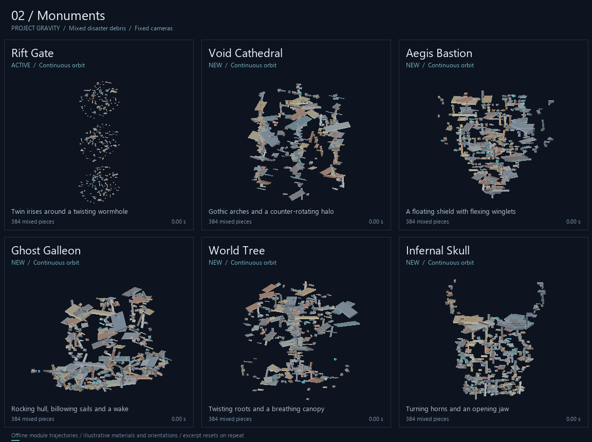

| Shape | Motion |
| --- | --- |
| Rift Gate | Twin irises around a twisting wormhole |
| Void Cathedral (new) | Gothic arches and a counter-rotating halo |
| Aegis Bastion (new) | A floating shield with flexing winglets |
| Ghost Galleon (new) | Rocking hull, billowing sails and a wake |
| World Tree (new) | Twisting roots and a breathing canopy |
| Infernal Skull (new) | Turning horns and an opening jaw |

## 03. Relics and storms

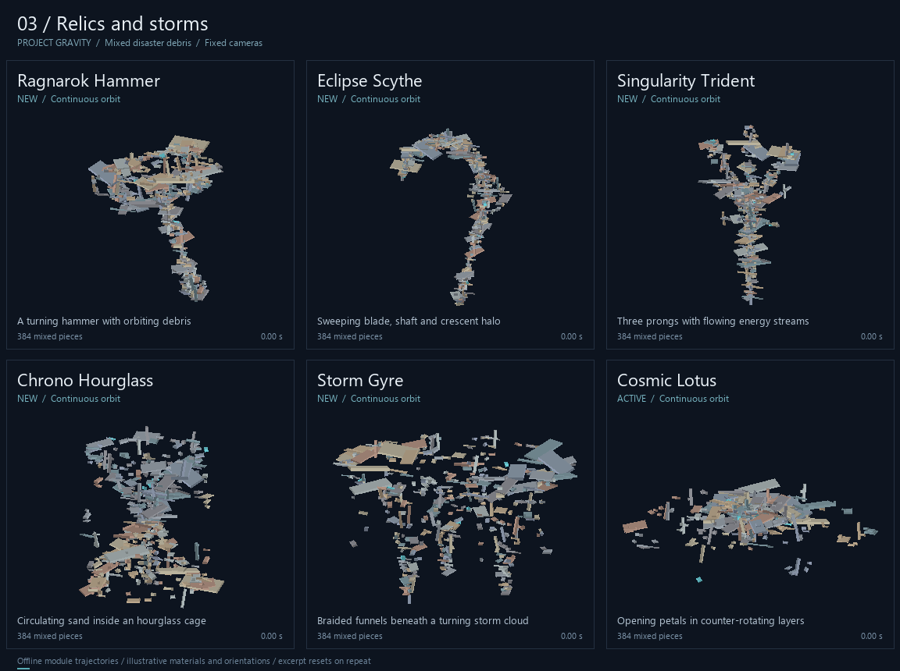

| Shape | Motion |
| --- | --- |
| Ragnarok Hammer (new) | A turning hammer with orbiting debris |
| Eclipse Scythe (new) | Sweeping blade, shaft and crescent halo |
| Singularity Trident (new) | Three prongs with flowing energy streams |
| Chrono Hourglass (new) | Circulating sand inside an hourglass cage |
| Storm Gyre (new) | Braided funnels beneath a turning storm cloud |
| Cosmic Lotus | Opening petals in counter-rotating layers |

## 04. Mathematical forms

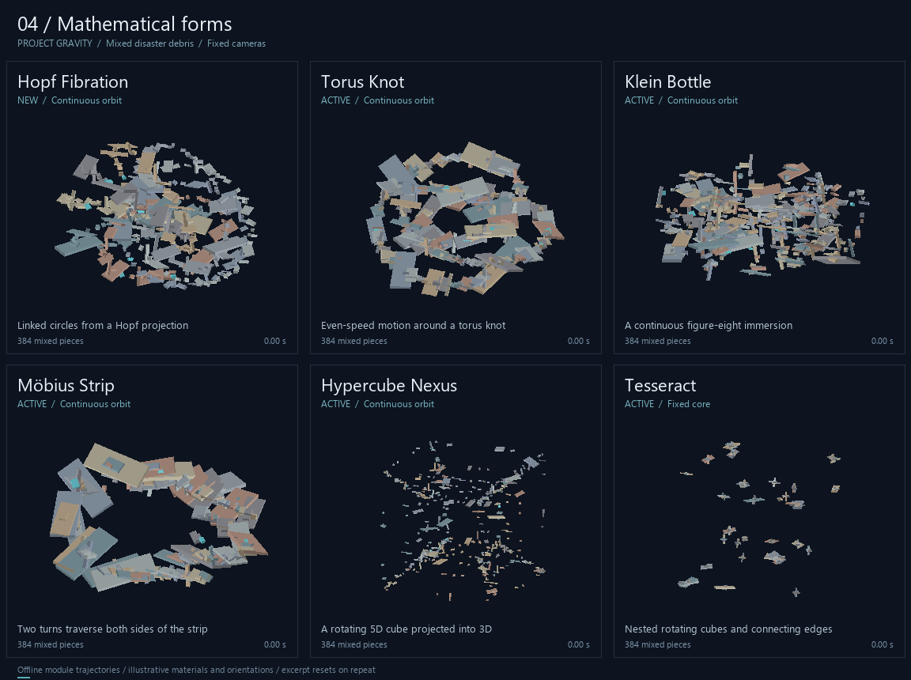

| Shape | Motion |
| --- | --- |
| Hopf Fibration (new) | Linked circles from a Hopf projection |
| Torus Knot | Even-speed motion around a torus knot |
| Klein Bottle | A continuous figure-eight immersion |
| Möbius Strip | Two turns traverse both sides of the strip |
| Hypercube Nexus | A rotating 5D cube projected into 3D |
| Tesseract | Nested rotating cubes and connecting edges |

## 05. Orbital machines

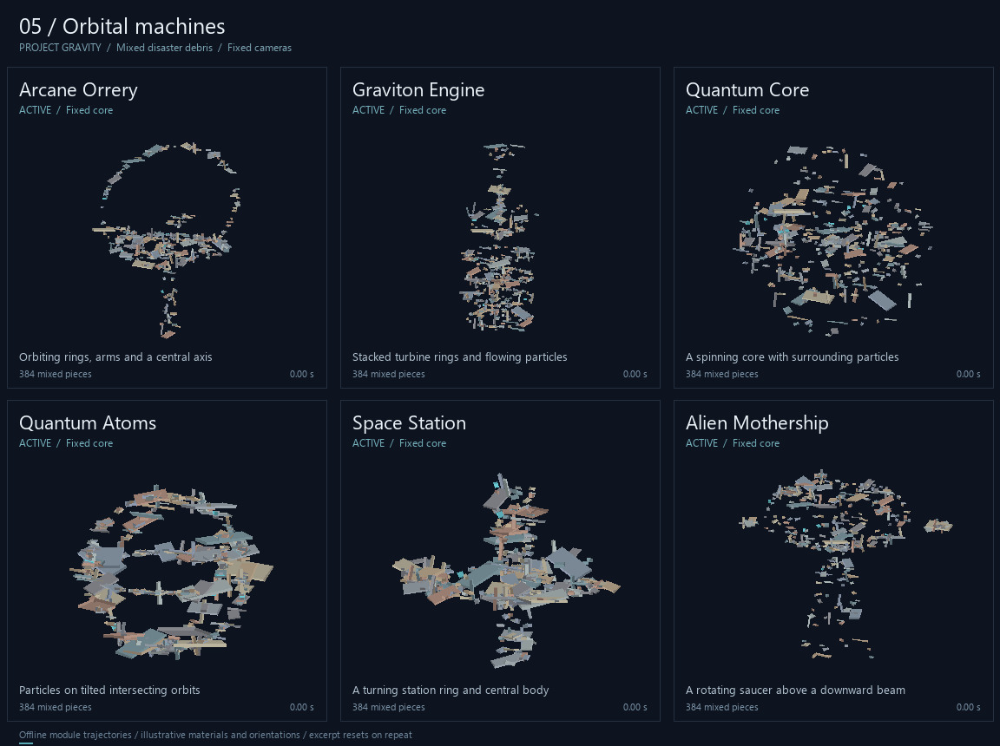

| Shape | Motion |
| --- | --- |
| Arcane Orrery | Orbiting rings, arms and a central axis |
| Graviton Engine | Stacked turbine rings and flowing particles |
| Quantum Core | A spinning core with surrounding particles |
| Quantum Atoms | Particles on tilted intersecting orbits |
| Space Station | A turning station ring and central body |
| Alien Mothership | A rotating saucer above a downward beam |

## 06. Sky phenomena

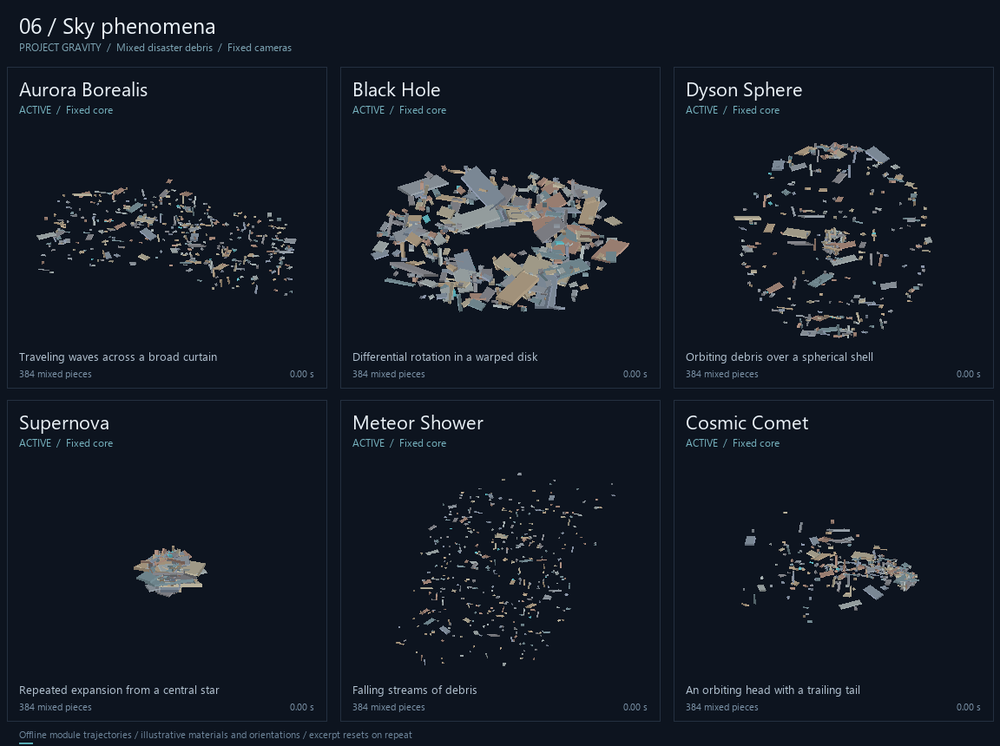

| Shape | Motion |
| --- | --- |
| Aurora Borealis | Traveling waves across a broad curtain |
| Black Hole | Differential rotation in a warped disk |
| Dyson Sphere | Orbiting debris over a spherical shell |
| Supernova | Repeated expansion from a central star |
| Meteor Shower | Falling streams of debris |
| Cosmic Comet | An orbiting head with a trailing tail |

## 07. Serpents and ribbons

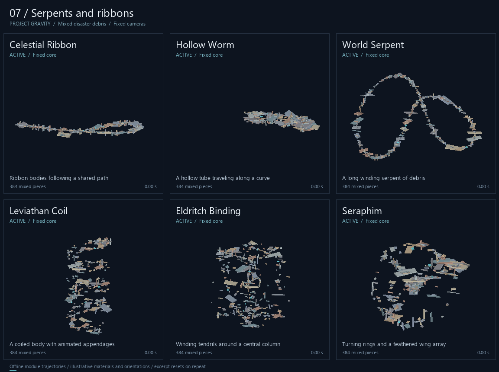

| Shape | Motion |
| --- | --- |
| Celestial Ribbon | Ribbon bodies following a shared path |
| Hollow Worm | A hollow tube traveling along a curve |
| World Serpent | A long winding serpent of debris |
| Leviathan Coil | A coiled body with animated appendages |
| Eldritch Binding | Winding tendrils around a central column |
| Seraphim | Turning rings and a feathered wing array |

## 08. Currents and webs

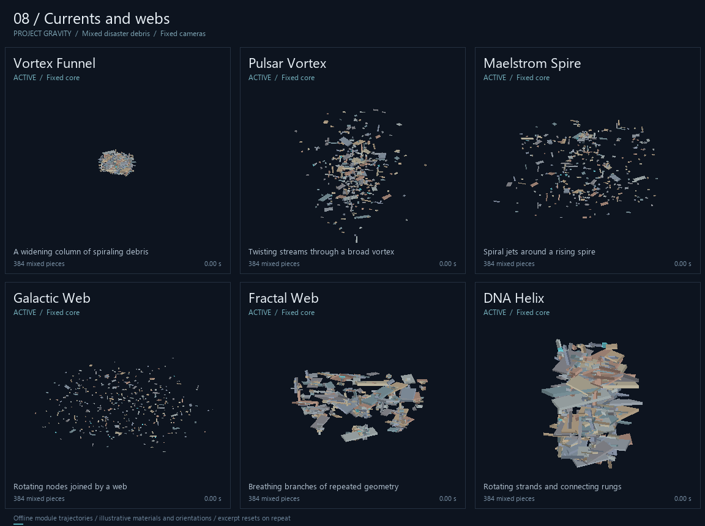

| Shape | Motion |
| --- | --- |
| Vortex Funnel | A widening column of spiraling debris |
| Pulsar Vortex | Twisting streams through a broad vortex |
| Maelstrom Spire | Spiral jets around a rising spire |
| Galactic Web | Rotating nodes joined by a web |
| Fractal Web | Breathing branches of repeated geometry |
| DNA Helix | Rotating strands and connecting rungs |

## 09. Spins and transformations

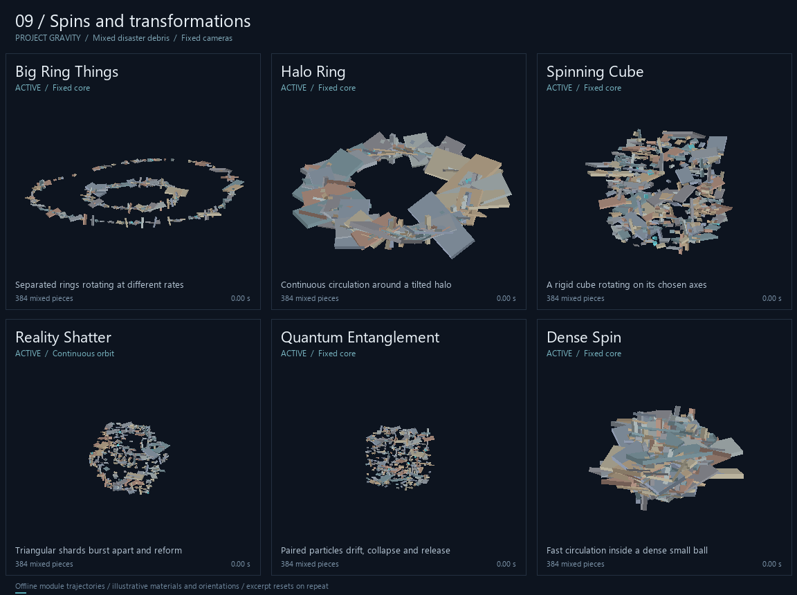

| Shape | Motion |
| --- | --- |
| Big Ring Things | Separated rings rotating at different rates |
| Halo Ring | Continuous circulation around a tilted halo |
| Spinning Cube | A rigid cube rotating on its chosen axes |
| Reality Shatter | Triangular shards burst apart and reform |
| Quantum Entanglement | Paired particles drift, collapse and release |
| Dense Spin | Fast circulation inside a dense small ball |

Gallery settings: Dense Spin: `k11=2`, `k12=20`. All other controls use module/config defaults.

## 10. Energy abilities

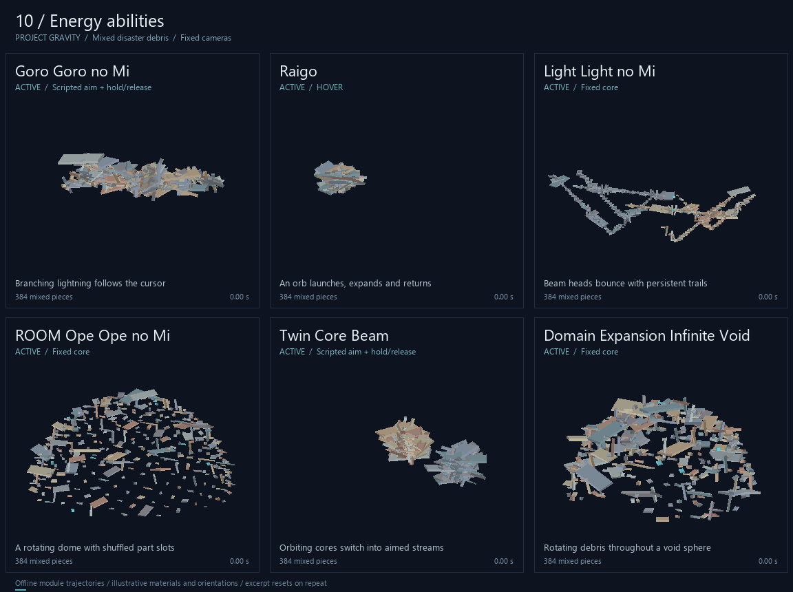

| Shape | Motion |
| --- | --- |
| Goro Goro no Mi | Branching lightning follows the cursor |
| Raigo | An orb launches, expands and returns |
| Light Light no Mi | Beam heads bounce with persistent trails |
| ROOM Ope Ope no Mi | A rotating dome with shuffled part slots |
| Twin Core Beam | Orbiting cores switch into aimed streams |
| Domain Expansion Infinite Void | Rotating debris throughout a void sphere |

Gallery settings: Light Light no Mi: `k13=1`, `k14=6`. All other controls use module/config defaults.

## 11. Tools and puppets

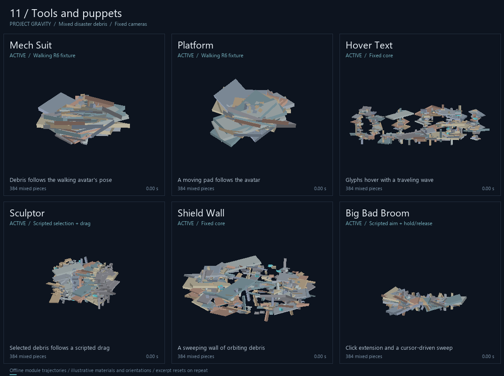

| Shape | Motion |
| --- | --- |
| Mech Suit | Debris follows the walking avatar's pose |
| Platform | A moving pad follows the avatar |
| Hover Text | Glyphs hover with a traveling wave |
| Sculptor | Selected debris follows a scripted drag |
| Shield Wall | A sweeping wall of orbiting debris |
| Big Bad Broom | Click extension and a cursor-driven sweep |

## 12. Launches and impacts

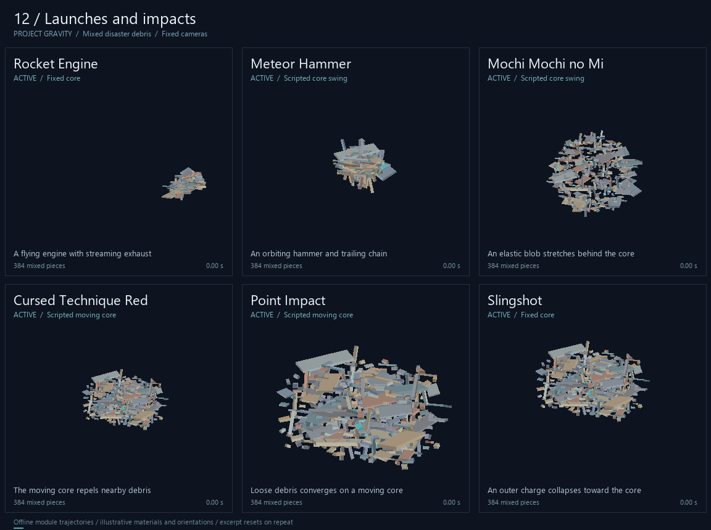

| Shape | Motion |
| --- | --- |
| Rocket Engine | A flying engine with streaming exhaust |
| Meteor Hammer | An orbiting hammer and trailing chain |
| Mochi Mochi no Mi | An elastic blob stretches behind the core |
| Cursed Technique Red | The moving core repels nearby debris |
| Point Impact | Loose debris converges on a moving core |
| Slingshot | An outer charge collapses toward the core |

## 13. World probes and review shapes

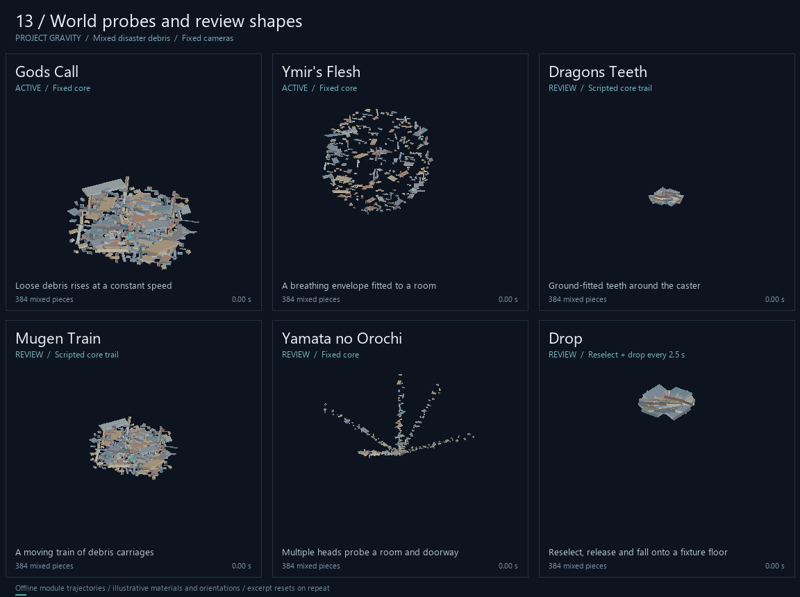

| Shape | Motion |
| --- | --- |
| Gods Call | Loose debris rises at a constant speed |
| Ymir's Flesh | A breathing envelope fitted to a room |
| Dragons Teeth (review) | Ground-fitted teeth around the caster |
| Mugen Train (review) | A moving train of debris carriages |
| Yamata no Orochi (review) | Multiple heads probe a room and doorway |
| Drop (review) | Reselect, release and fall onto a fixture floor |

## Rebuild

Install [Lune](https://github.com/lune-org/lune) and Pillow, then run from the repository root:

```powershell
python tools/preview_shapes.py --all --parts 384 --cell 384 --frames 72 --duration 6 --output docs/motion
```

Use `--lune PATH` if needed. `--no-cache` resamples; `--no-fixtures` disables scripted interactions. Per-shape settings, source fingerprints and motion checks are in [manifest.json](manifest.json).
